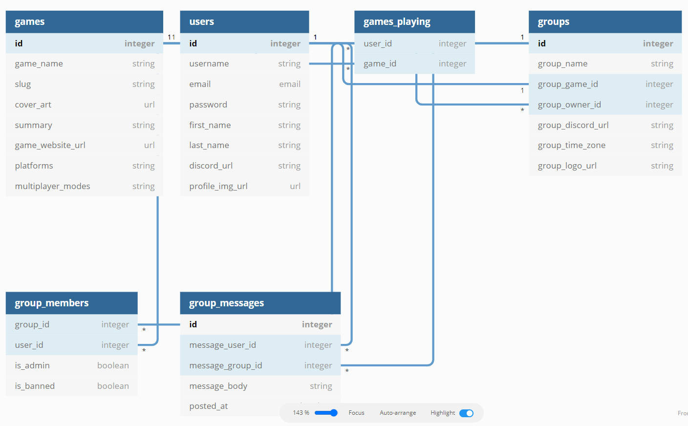

# Capstone 2 Proposal

## Tech Stack

---

This project will use React and Node.js as its foundation.  

## Backend, Fronted or Fullstack?

---

This project will be evenly full stack.

## Webstie, Mobile app or something else?

---

This will be a website

## Project Goal

---

The goal of this project is to provide gamers an online platform to find, create, join and interact with groups, clans and parties of other gamers playing the same game as their selves for the express purpose of playing together.

## Demographic

---

The anticipated demographic for visitors to this site are individuals interested in finding groups of other individuals for the express purpose of playing video games together where online play is supported.

## Data you plan on using

---

The data used will be user login information, profile images, and video game information.  
The video game information will be collected from Twitch's IGDB API

## Approach to creating the app

---

My approach will be to first select a frontend React theme, as design is not my strong suit, and modify it to suit the app's needs

### The database schema

1. Games
   * ID [pk]
   * game_name
   * slug
   * cover_art
   * summary
   * game_website_url
   * platforms
   * multiplayer_modes
2. Users
   * ID [pk]
   * username
   * email
   * password
   * first Name
   * last Name
   * discord URL
   * profile_img_url
3. Games_playing
   * User_id
   * Game_id
4. Groups
   * ID [pk]
   * group_name
   * group_game_id
   * group_owner_id
   * group_discord_url
   * group_time_zone
   * group_logo_url
5. Group_members
   * group_id
   * user_id
   * is_admin
   * is_banned
6. Group Messages
   * ID [pk]
   * message_user_id
   * message_group_id
   * message_body
   * posted_at

### Anticipated issues

The major issue I anticipate with the api is the complexity of it. The app will utilize the Twitch [IGDB API](https://api-docs.igdb.com/#about) to gather all game data.  
Because of the strict rate limit of this api, it will be used to initialize the database, rather than make requests to get game data for every request made by users.  
I will also be using AWS S3 for the storage/serving of user profile images, as well as creating my own backend api as the api I have chosen to collect the necessary data will not fully serve my purposes

## Information requested from the users

---

1. Requested username
1. Email address
1. Password
1. First and Last name (optional)
1. Discord URL(optional)  
   * The discord url is for those that operate their own discord server, and wish for players to join them in it.
1. At least one game they are interested in
1. In game name for said game (if any, or if different from requested username)

### Sensitive information

The only sensitive information I will be gathering is the user’s password, which will be stored using hashing.

## App Functionality

---

The functionality of the app will include, but will not be limited to

1. User login authentication
1. Joining existing player groups
1. Creating player groups
1. Searching for existing player groups
1. Adding/Removing games from their list of games they are playing
1. Adding/Removing players from the group (group admin only)

## User Flow

---

* General
   1. Accessing the site
   1. Logging in/Registering
   1. Displayed a page that lists the games they play and the groups they manage/joined
* Games
   1. Finding a new game to add to their list
   1. Adding the game to their list
   1. Displayed a page of groups for the selected game
* Groups
   1. Finding a new group to join
   1. Clicking into group page
   1. Requesting to join the group (if not open to the public)
      * Provide short message(optional)
   1. Once joined, the group is added to their groups
* Creating a new group
   1. Select the game the group is for
   1. Create name for group
   1. Decide if open to the public, or join with request
   1. Write description of group, like type of players they want to join, timezone, country, etc…
   1. Provide discord link (optional)
* Managing group
   1. Approve/decline join requests
      * Join requests include a link to the user’s profile
   1. Can remove players from group
   1. Can ban users from the group
   1. Can delete the group

## Features that make this a CRUD app

---

* Creation of users
* Creation of groups
* Addition and removal of users from groups
* Deletion of groups
* Updating one’s own user profile
* Updating group’s information (if admin)
* Adding and removing games from profile
* Deletion of one’s own user profile
